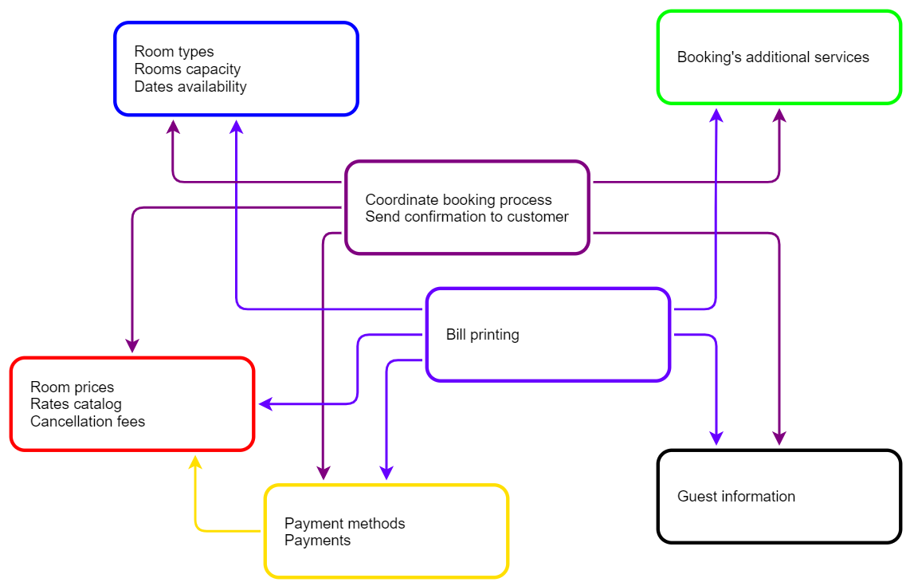
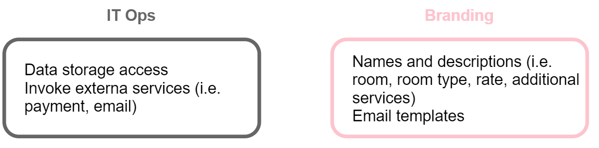
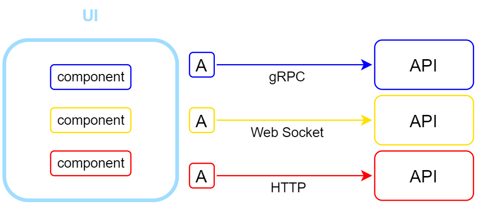

# Advanced Distributed Systems Design - Hotel Booking

Demo app designed with the SOA definition described in the Advanced Distributed Systems Design course by Udi Dahan.

## Design

The system will be composed of seven business-specific services. 
The diagram shows the [efferent coupling](https://en.wikipedia.org/wiki/Efferent_coupling) between the services, where the arrows mean "depends on / knows".

As shown in the image, the purple and indigo services have the highest levels of coupling: this is because they both operate as orchestrators (i.e. as a semaphonre) or aggregators (i.e. composing models based upon external data).

## Companion services

Every system designed with SOA will have two additional services: IT Ops and Branding. 
These services are primarily technical in nature and tend to have no dependencies, and they're used (e.g. dll reference) by the other services. 

IT Ops is responsible for things like integration and data transformations. 
Branding is responsible for localization, wording and UI assets.

## UI composition

The UI will communicate with a backing [gateway](https://docs.microsoft.com/en-us/azure/architecture/patterns/gateway-aggregation) in order to interact with the services.

The gateway will use a series of [ambassadors](https://docs.microsoft.com/en-us/azure/architecture/patterns/ambassador) provided by each service in order to reduce the platform and schema coupling. 
The results will be aggregated into a generic structure, sent back as a response and then interpreted by specific UI components, also owned by the services.

